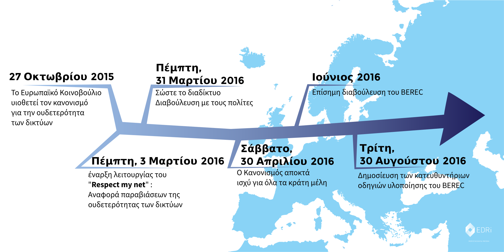

{{ BEGIN MODAL }}
### Internet wins
{{ BEGIN MODAL-SPLIT }}

This summer, hundreds of thousands of Internet users banded together to keep the Internet open and free. Together, we sent a loud, clear message to BEREC, the Body of European Regulators of Electronic Communications: protect net neutrality. 

And it worked! BEREC's final guidelines, which were published on 30 August 2016, offer some of the strongest net neutrality protections we could wish for. So long as these new rules are properly enforced by national telecom regulators, they represent a resounding victory for net neutrality. 

The public has made clear that will not leave the future of its digital public space to big telco lobbyists, but wants to decide for itself. To that end, civil society has to [stay watchful](https://respectmynet.eu/) and observe that telecom operators don't violate the new principles.

The consultation came as the final step of a legislative process that was launched in September 2013. During the ensuing three years, the SaveTheInternet.eu coalition campaigned successfully for the Regulation on which the consultation is based.

**SaveTheInternet.eu wants to thank everyone who participated in this outstanding effort to protect the free, open Internet! Thank you!**

{{ END MODAL }}

{{ BEGIN HOME INTRO }}
{{ BEGIN NAVIGATION }}
{: .navigation__sections}
- [ΠΛΗΡΟΦΟΡΙΕΣ](#info){: data-scroll="true" }
- [FAQ](faq)

{{ END NAVIGATION }}

# Σώστε το διαδίκτυο

{: .title-subtext}
Οι ευρωπαϊκές Ρυθμιστικές Αρχές πρόκειται να αποφασίσουν αν θα δώσουν στους μεγάλους τηλεπικοινωνιακούς παρόχους τη δύναμη να επηρεάζουν το τι μπορούμε και τι δεν μπορούμε να κάνουμε online. Η Ευρώπη χρειάζεται επειγόντως σαφείς κανόνες για την ουδετερότητα των δικτύων για την προστασία των online ελευθεριών και δικαιωμάτων μας.

{{ BEGIN COUNTER }}

| X | ΑΤΟΜΑ ΕΧΟΥΝ   ΣΤΕΙΛΕΙ ΜΗΝΥΜΑΤΑ |

comments sent via savetheinternet.eu, [Avaaz](https://secure.avaaz.org/en/save_the_internet_eu_loc_2016/), [savenetneutrality.eu](https://actionnetwork.org/petitions/save-eu-net-neutrality), [OpenMedia](https://act.openmedia.org/TollBooth/) and [Access Now](https://act.accessnow.org/ea-action/action?ea.client.id=1921&ea.campaign.id=51950)

{{ END COUNTER }}

{{ END HOME INTRO }}

{{ BEGIN HOME FIX-NET-NEUTRALITY }}

## Τι είναι αυτό που πρέπει να διορθωθεί:

{{ BEGIN HOME SPECIALISED-SERVICES }}

### Specialised Services

Υπάρχει ο κίνδυνος να γίνουν οι εξειδικευμένες υπηρεσίες η επί πληρωμή γρήγορη λωρίδα για τις μεγάλες διαδικτυακές επιχειρήσεις που εκτοπίζουν στην αργή λωρίδα κάθε άλλο ιστότοπο, ιδέα και νεοφυή επιχείρηση.

[ΔΙΑΒΆΣΤΕ ΠΕΡΙΣΣΌΤΕΡΑ](faq/#what-are-specialised-services)

{{ END HOME SPECIALISED-SERVICES }}

{{ BEGIN HOME TRAFFIC-MANAGEMENT }}

### Traffic Management

Μην επιτρέπετε στον πάροχο διαδικτύου σας να αποφασίζει κατά την κρίση του ποια κίνηση είναι σημαντική και ποιες online υπηρεσίες θα επιβραδύνει.

[ΔΙΑΒΆΣΤΕ ΠΕΡΙΣΣΌΤΕΡΑ](faq/#what-is-traffic-management)

{{ END HOME TRAFFIC-MANAGEMENT }}

{{ BEGIN HOME ZERO-RATING }}

### Zero Rating

Ακούγεται σαν να παίρνετε κάτι δωρεάν, αλλά στην πραγματικότητα αυτό μετατρέπει τον πάροχο υπηρεσιών κινητής επικοινωνίας σας σε «φρουρό» και του δίνει έναν λόγο να μειώσει τα μηνιαία όρια όγκου δεδομένων.

[ΔΙΑΒΆΣΤΕ ΠΕΡΙΣΣΌΤΕΡΑ](faq/#what-is-zero-rating)

{{ END HOME ZERO-RATING }}

{{ END HOME FIX-NET-NEUTRALITY }}

{{ BEGIN HOME SPREAD-THE-WORD }}

[Κοινοποιήστε στο Facebook](http://www.facebook.com/sharer.php?u=https://savetheinternet.eu/el/)

[Κοινοποιήστε στο Twitter](https://twitter.com/intent/tweet?text=Help%20save%20the%20internet.%20Tell%20your%20regulator%20to%20safeguard%20net%20neutrality.%20http%3A%2F%2Fwww.savetheinternet.eu%2F%20%23SaveTheInternet)

{{ END HOME SPREAD-THE-WORD }}

{{ BEGIN HOME NEWSLETTER }}
{{ END HOME NEWSLETTER }}

{{ BEGIN HOME VIDEO }}
{{ END HOME VIDEO }}

{{ BEGIN HOME INFO }}
{{ ANCHOR INFO }}
## Το 2015 η Ευρωπαϊκή Ένωση υιοθέτησε τη νομοθεσία σχετικά με την ουδετερότητα των δικτύων ...

[Ο Κανονισμός της ΕΕ](http://eur-lex.europa.eu/legal-content/EN/TXT/?uri=CELEX:32015R2120){: target="_blank" } περιέχει καλές βασικές αρχές για τη διασφάλιση της δυνατότητάς σας να συνδέεστε σε οποιοδήποτε σημείο του διαδικτύου χωρίς διακρίσεις. Ωστόσο, θα μπορούσε να γίνει κατάχρηση ορισμένων σημείων του Κανονισμού και να υπονομευτεί η ουδετερότητα των δικτύων. Οι νομοθέτες αποφάσισαν να αφήσουν την ευθύνη για τη διευκρίνιση των ασαφειών του κειμένου στις ρυθμιστικές αρχές για τις τηλεπικοινωνίες.
{{ END HOME INFO }}

{{ BEGIN HOME BEREC-1 }}
Ο Φορέας Ευρωπαϊκών Ρυθμιστικών Αρχών για τις Ηλεκτρονικές Επικοινωνίες (BEREC) πρέπει να καταρτίσει κατευθυντήριες οδηγίες υλοποίησης για την ερμηνεία των αμφισβητούμενων σημείων της νομοθεσίας μέχρι το τέλος Αυγούστου 2016. Αυτές οι κατευθυντήριες οδηγίες θα καθορίσουν αν η Ευρώπη θα απολαμβάνει την ουδετερότητα των δικτύων ή όχι.
{{ END HOME BEREC-1 }}

{{ BEGIN HOME BEREC-2 }}
Τον Ιούνιο 2016, ο BEREC προγραμματίζει να δημοσιεύσει το προσχέδιο των κατευθυντήριων οδηγιών του και να ξεκινήσει μια δημόσια διαβούλευση. Ωστόσο, οι διαδικαστικοί κανόνες του BEREC προβλέπουν ότι το κοινό μπορεί να αποκριθεί μόνο __από τις 6 Ιουνίου ως τις 18 Ιουλίου__ και ο Κανονισμός προβλέπει ότι ο BEREC θα πρέπει να δημοσιεύσει τις τελικές κατευθυντήριες οδηγίες του στις 30 Αυγούστου 2016. Αυτό σημαίνει ότι οι πολίτες θα έχουν μόνο __μερικές εβδομάδες__ για να συμμετάσχουν στη διαβούλευση και ο BEREC θα έχει μόνο __έναν μήνα και κάτι__ για να επεξεργαστεί τα (ενδεχομένως χιλιάδες) σχόλια, να συντάξει τα προσχέδια ενημέρωσης των κατευθυντήριων οδηγιών του και, στη συνέχεια, να εφαρμόσει τις διοικητικές διαδικασίες ώστε να συμφωνήσει επίσημα σε οποιαδήποτε αλλαγή κάνει στο προσχέδιο.
{{ END HOME BEREC-2 }}

{{ BEGIN HOME BEREC-3 }}
## Χάρτης ουδετερότητας των δικτύων της ΕΕ

{{ END HOME BEREC-3 }}

{{ BEGIN HOME BEREC-4 }}
### __Αυτό είναι ένα κρίσιμο σημείο: Πρόκειται για το βήμα όπου επιτεύχθηκαν πολλά στις ΗΠΑ και την Ινδία. Γι' αυτόν τον λόγο πρέπει να συνεχίσουμε να πιέζουμε για πραγματική ουδετερότητα των δικτύων, πείθοντας τις ρυθμιστικές αρχές σχετικά με την αξία του ελεύθερου και ανοικτού διαδικτύου.__

Οι ρυθμιστικές αρχές πρέπει να εξοπλιστούν με τα εργαλεία που χρειάζονται για την επιβολή της ουδετερότητας των δικτύων. Στο Save The Internet, πιστεύουμε ότι ο BEREC δεν θα έχει αρκετό χρόνο για να επεξεργαστεί και να λάβει δεόντως υπόψη τις πιθανόν δεκάδες χιλιάδες απαντήσεις (η ρυθμιστική αρχή τηλεπικοινωνιών των ΗΠΑ έλαβε 3,7 εκατομμύρια απαντήσεις στη δική της διαβούλευση!). Μπορούμε να αποκαταστήσουμε την ισορροπία δίνοντας τη δυνατότητα στον οποιονδήποτε να συμβάλει στις κατευθυντήριες οδηγίες με πιο αποτελεσματικό τρόπο.

{{ END HOME BEREC-4 }}

{{ BEGIN HOME CONTACT-US }}
### Επικοινωνήστε μαζί μας

__Μη διστάσετε να επικοινωνήσετε μαζί μας στη διεύθυνση [info@savetheinternet.eu](mailto:info@savetheinternet.eu)__

Έχετε κάποια ιδέα για να βελτιώσουμε αυτόν τον ιστότοπο; Πολύ ωραία, σας χρειαζόμαστε! Ο πλήρης κώδικας πηγής αυτού του ιστοτόπου βρίσκεται στη διεύθυνση [GitHub](https://github.com/Netzfreiheit/STI-UI) και μπορεί να υποβληθεί σε forking, βελτιώσεις ή ανασυνδυασμό και να επιστραφεί σε εμάς.

Ένα πράγμα που χρειαζόμαστε πάντα είναι βοήθεια στις μεταφράσεις, οπότε αν μιλάτε μια γλώσσα που δεν έχουμε ήδη καλύψει, επικοινωνήστε μαζί μας.

### Πολιτική προστασίας απορρήτου

Αποθηκεύουμε τα σχόλιά σας για τη διαβούλευση του BEREC στα Εισερχόμενα μιας διεύθυνσης ηλεκτρονικού ταχυδρομείου που φιλοξενείται στην Αυστρία, μέχρι να προωθήσουμε αυτά τα μηνύματα ηλεκτρονικού ταχυδρομείου με τα σχόλιά σας στην επίσημη διαβούλευση του BEREC. Μπορείτε να βρείτε την πολιτική προστασίας απορρήτου του BEREC για τις διαβουλεύσεις [εδώ](http://berec.europa.eu/eng/document_register/subject_matter/berec_office/download/0/4615-privacy-statement-berec-office-policy-do_0.pdf). Οι φορείς Arbeitskreis Vorratsdaten Österreich και Bits of Freedom έχουν πρόσβαση, επεξεργάζονται και θα διατηρήσουν τα σχόλια και τις διευθύνσεις ηλεκτρονικού ταχυδρομείου που αποστέλλονται στον BEREC μέσω αυτού του ιστοτόπου για τεχνικούς σκοπούς. Ο BEREC θα δημοσιεύσει όλες τις απαντήσεις που δεν είναι επισημασμένες ως εμπιστευτικές. Οι οργανισμοί που στηρίζουν αυτήν την εκστρατεία αναφέρονται στο κάτω μέρος της σελίδας σε αυτόν τον ιστότοπο. Έναν μήνα μετά το τέλος της επίσημης περιόδου διαβούλευσης, θα διαγράψουμε όλα τα σχόλια και τις ηλεκτρονικές διευθύνσεις που συσχετίζονται με αυτά.

Σε αυτόν τον ιστότοπο συλλέγουμε μη προσωπικά στοιχεία με το [Piwik](https://piwik.org/), ένα φιλικό προς το ιδιωτικό απόρρητο λογισμικό ανάλυσης δεδομένων Ιστού.

Αν [εγγραφείτε συνδρομητές στο newsletter](#subscribe-to-newsletter){: data-scroll="true"} η διεύθυνση ηλεκτρονικού σας ταχυδρομείου θα αποθηκευτεί σε έναν κατάλογο παραληπτών και μια βάση δεδομένων, της οποίας η διαχείριση και η φιλοξενία γίνονται από τον φορέα European Digital Rights. Είναι ο μόνος οργανισμός που έχει το δικαίωμα να σας στέλνει μηνύματα αν εγγραφείτε για το newsletter. Μπορείτε να καταργήσετε τη συνδρομή σας στο newsletter οποιαδήποτε στιγμή και δεν θα λάβετε άλλα μηνύματα.
 {{ END HOME CONTACT-US }}

{{ BEGIN HOME SUPPORTED-BY }}
Είμαστε προβληματισμένοι πολίτες από ΜΚΟ της Ευρώπης που ενδιαφερόμαστε για τις ελευθερίες των πολιτών στον κυβερνοχώρο.
{{ LOGOS SUPPORTED-BY }}
{{ END HOME SUPPORTED-BY }}

{{ BEGIN HOME MADE-BY }}
Με φιλική υποστήριξη από
{{ LOGOS MADE-BY }}
{{ END HOME MADE-BY }}
