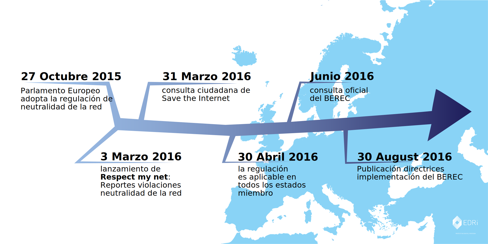

{{ BEGIN MODAL }}
### Internet wins
{{ BEGIN MODAL-SPLIT }}

Este verano, cientos de miles de usuarios de Internet se unieron para mantener Internet abierto y libre. Juntos, hemos enviado un mensaje alto y claro al BEREC, el Organismo de Reguladores Europeos de las Comunicaciones Electrónicas: proteged la neutralidad de la red.

¡Y funcionó! Las directrices finales del BEREC, que fueron publicadas el 30 de agosto de 2016, contienen algunas de las más fuertes protecciones para la  neutralidad de la red que podríamos desear. Siempre que estas nuevas reglas se cumplan adecuadamente por los reguladores nacionales de telecomunicaciones, representan una vibrante victoria para la neutralidad de la red.

El público ha dejado claro que no va a dejar el futuro de su espacio público digital en manos de los grandes lobbies de las telecomunicaciones, sino que quiere decidir por sí mismo. A tal fin, la sociedad civil tiene que [permanecer vigilante](https://respectmynet.eu/) y asegurarse de que los operadores de telecomunicaciones no violen estos nuevos principios.

La consulta fue el último paso de un proceso legislativo que se lanzó en septiembre de 2013. Durante estos tres años la coalición SaveTheInternet.eu ha estado llevando a cabo la campaña en defensa por la neutralidad de la red cuyo éxito podemos celebrar hoy.

**SaveTheInternet.eu wants to thank everyone who participated in this outstanding effort to protect the free, open Internet! Thank you!**

{{ END MODAL }}

{{ BEGIN HOME INTRO }}
{{ BEGIN NAVIGATION }}
{: .navigation__sections}
- [INFORMACIÓN](#info){: data-scroll="true" }
- [PREGUNTAS FRECUENTES](faq)
{{ END NAVIGATION }}

# Save the Internet

{: .title-subtext}
Los Reguladores Europeos están a punto de decidir si darle a las grandes corporaciones de telecomunicaciones el poder
de influir en lo que puedes (y no puedes) hacer online. Europa necesita urgentemente directrices claras de neutralidad de la red
para proteger nuestras libertades y derechos online.

{{ BEGIN COUNTER }}

| X | PERSONAS HAN   ENVIADO MENSAJES |

comments sent via savetheinternet.eu, [Avaaz](https://secure.avaaz.org/en/save_the_internet_eu_loc_2016/), [savenetneutrality.eu](https://actionnetwork.org/petitions/save-eu-net-neutrality), [OpenMedia](https://act.openmedia.org/TollBooth/) and [Access Now](https://act.accessnow.org/ea-action/action?ea.client.id=1921&ea.campaign.id=51950)

{{ END COUNTER }}

{{ END HOME INTRO }}

{{ BEGIN HOME FIX-NET-NEUTRALITY }}

## Qué hay que solucionar:

{{ BEGIN HOME SPECIALISED-SERVICES }}

### Servicios Especializados

Los servicios especializados amenazan en convertirse la vía rápida de pago para las grandes compañías de Internet, empujando a todos los demás sitios web, ideas y "start-ups" a la línea lenta.

[LEER MÁS](faq/#que-son-los-servicios-especializados)

{{ END HOME SPECIALISED-SERVICES }}

{{ BEGIN HOME TRAFFIC-MANAGEMENT }}

### Gestión del Tráfico

No permitas que tu proveedor de Internet decida por ti que tráfico es importante y que servicios ralentiza a su propio criterio.

[LEER MÁS](faq/#que-es-la-gestion-del-trafico)

{{ END HOME TRAFFIC-MANAGEMENT }}

{{ BEGIN HOME ZERO-RATING }}

### Zero Rating

Aunque parezca que te dan algo gratis, tu operador móvil se convierte en guarda de tu conexión y le da una razón para mantener bajo tu límite de datos mensual.

[READ MORE](faq/#que-es-el-zero-rating)

{{ END HOME ZERO-RATING }}

{{ END HOME FIX-NET-NEUTRALITY }}

{{ BEGIN HOME SPREAD-THE-WORD }}

[Comparte en Facebook](http://www.facebook.com/sharer.php?u=https://savetheinternet.eu/es/)

[Comparte en Twitter](https://twitter.com/intent/tweet?text=Ayuda%20a%20salvar%20internet.%20Pídele%20a%20tu%20regulador%20que%20proteja%20la%20neutralidad%20de%20la%20red%20http%3A%2F%2Fwww.savetheinternet.eu%2Fes%2F%20%23SaveTheInternet%20%23NetNeutrality)

{{ END HOME SPREAD-THE-WORD }}

{{ BEGIN HOME NEWSLETTER }}
{{ END HOME NEWSLETTER }}

{{ BEGIN HOME VIDEO }}
{{ END HOME VIDEO }}

{{ BEGIN HOME INFO }}
{{ ANCHOR INFO }}
## En 2015, la Unión Europea adoptó una legislación sobre neutralidad de la red...

[La Regulación EU](http://eur-lex.europa.eu/legal-content/ES/TXT/?uri=CELEX:32015R2120){: target="_blank" } contiene buenos principios para asegurar que puedas conectarte a cualquier otro punto de la red sin discriminaciones. No obstante, existe el peligro de que se abuse de algunas partes de la regulación para minar la neutralidad de la red. Los legisladores decidieron dejar en manos de los reguladores de telecomunicaciones la responsabilidad de aclarar las incertidumbres del texto.
{{ END HOME INFO }}

{{ BEGIN HOME BEREC-1 }}
El Organismo de Reguladores Europeos de las Comunicaciones Electrónicas (BEREC, Body of European Regulators of the Electronic Communications) tiene que preparar las directrices de implementación que interpreten las ambigüedades de la ley para finales de agosto de 2016. Estas directrices determinarán si Europa consigue tener una red neutral o no.
{{ END HOME BEREC-1 }}

{{ BEGIN HOME BEREC-2 }}
En Junio de 2016, el BEREC publicará el borrador de sus directrices y lanzará una consulta pública. Sin embargo, de acuerdo con los procedimientos del BEREC la consulta estará abierta 20 días hábiles y el BEREC tiene que publicar sus directrices finales el 30 de agosto de 2016. Esto significa que los ciudadanos dispondremos solo de un mes para responder a la consulta y el BEREC tiene a penas unas pocas semanas para procesar los (potencialmente miles) de comentarios, actualizar sus directrices, y después pasar por el proceso administrativo para aceptar formalmente cualquier cambio al borrador inicial.
{{ END HOME BEREC-2 }}

{{ BEGIN HOME BEREC-3 }}
## Guía de la Neutralidad de la Red en la UE

{{ END HOME BEREC-3 }}

{{ BEGIN HOME BEREC-4 }}
### __Éste es un momento crucial: Ésta es la fase en la que enormes victorias se ganaron en Estados Unidos y la India. Así pues, debemos continuar presionando por una neutralidad de la red real convenciendo a los reguladores del valor de una Internet libre y abierta.__

Los reguladores deben proveerse de las mejores herramientas para aplicar la neutralidad de la red. En Save The Internet pensamos que el BEREC no tendrá suficiente tiempo para procesar debidamente y tener en cuenta las miles de respuestas (¡los reguladores de telecomunicaciones de EEUU recibieron 3,7 millones de respuestas a su consulta!). Podemos re-equilibrar la balanza permitiendo que todo el mundo pueda contribuir en la elaboración de las directrices de manera apropiada.

{{ END HOME BEREC-4 }}

{{ BEGIN HOME CONTACT-US }}
### Contacta con nosotros

__Puedes contactar con nosotros en [info@savetheinternet.eu](mailto:info@savetheinternet.eu)__

¿Tienes ideas para mejorar la web? ¡Estupendo, te necesitamos! El código fuente de la página está disponible en [GitHub](https://github.com/Netzfreiheit/STI-UI), puedes hacer un "fork", mejorar, remezclar y luego hacernos un "push" de vuelta.

Una de las cosas que siempre necesitamos es ayuda con las traducciones, así que si hablas algún idioma que no tenemos cubierto hasta ahora, por favor contacta con nosotros.

### Política de Privacidad

Almacenamos tus comentarios para el BEREC en la bandeja de entrada de una dirección e-mail alojada en Austria hasta que los enviemos todos, junto a vuestros comentarios, a la consulta oficial del BEREC. Puedes leer la política de privacidad para las consultas del BEREC [aquí](http://berec.europa.eu/eng/document_register/subject_matter/berec_office/download/0/4615-privacy-statement-berec-office-policy-do_0.pdf). Arbeitskreis Vorratsdaten Österreich y Bits of Freedom tienen acceso, procesan y conservan los comentarios y direcciones de e-mail enviados al BEREC a través de esta página web. El BEREC publicará todas las respuestas que no hayan sido marcadas como confidenciales. Las organizaciones impulsoras de esta campaña están listadas al final de este página. Eliminaremos todos los comentarios y direcciones de correo asociadas a esos comentarios un mes después de que acabe el periodo de la consulta oficial.

Recogemos información no-personal en esta web a través del software respetuoso con la privacidad [Piwik](https://piwik.org/).

Si te [suscribes a nuestra newsletter](#subscribe-to-newsletter){: data-scroll="true"} tu correo electrónico será almacenado en una lista de correo y una base de datos administrada y alojada por European Digital Rights. Ellos son la única organización que tiene el derecho a enviarte mensajes si te registras a la newsletter. Podrás darte de baja de la newsletter en cualquier momento y no recibirás más mensajes.
{{ END HOME CONTACT-US }}

{{ BEGIN HOME SUPPORTED-BY }}
Somos ciudadanos preocupados de diferentes organizaciones por toda Europa que cuidan las libertades en el espacio digital.
{{ LOGOS SUPPORTED-BY }}
{{ END HOME SUPPORTED-BY }}

{{ BEGIN HOME MADE-BY }}
Con el apoyo de
{{ LOGOS MADE-BY }}
{{ END HOME MADE-BY }}
