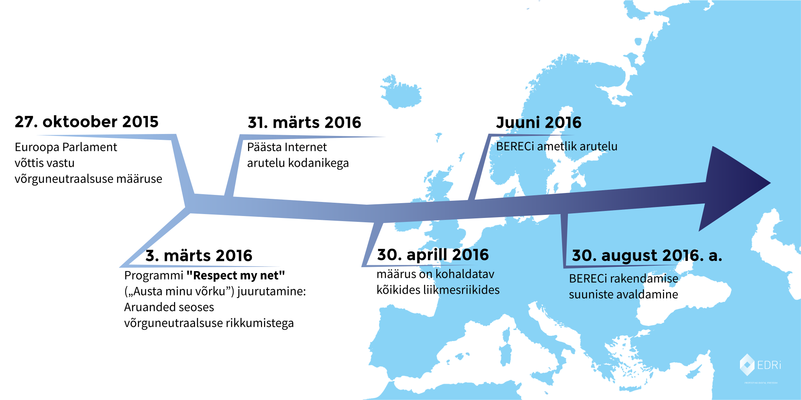

{{ BEGIN MODAL }}
### Internet wins
{{ BEGIN MODAL-SPLIT }}

This summer, hundreds of thousands of Internet users banded together to keep the Internet open and free. Together, we sent a loud, clear message to BEREC, the Body of European Regulators of Electronic Communications: protect net neutrality. 

And it worked! BEREC's final guidelines, which were published on 30 August 2016, offer some of the strongest net neutrality protections we could wish for. So long as these new rules are properly enforced by national telecom regulators, they represent a resounding victory for net neutrality. 

The public has made clear that will not leave the future of its digital public space to big telco lobbyists, but wants to decide for itself. To that end, civil society has to [stay watchful](https://respectmynet.eu/) and observe that telecom operators don't violate the new principles.

The consultation came as the final step of a legislative process that was launched in September 2013. During the ensuing three years, the SaveTheInternet.eu coalition campaigned successfully for the Regulation on which the consultation is based.

**SaveTheInternet.eu wants to thank everyone who participated in this outstanding effort to protect the free, open Internet! Thank you!**

{{ END MODAL }}

{{ BEGIN HOME INTRO }}
{{ BEGIN NAVIGATION }}
{: .navigation__sections}
- [TEAVE](#info){: data-scroll="true" }
- [KKK](faq)

{{ END NAVIGATION }}

# Päästke Internet

{: .title-subtext}
Euroopa reguleerivad asutused otsustavad, kas anda võim suurtele sideettevõtetele, mis mõjutaks kõike, mida me saame (ja ei saa) veebipõhiselt teha. Euroopa vajab selgeid võrguneutraalsuse eeskirju, et kaitsta meie veebipõhist vabadust ja õigusi.

{{ BEGIN COUNTER }}

| X | INIMEST ON   SAATNUD SÕNUMI – JÄÄNUD ON |

comments sent via savetheinternet.eu, [Avaaz](https://secure.avaaz.org/en/save_the_internet_eu_loc_2016/), [savenetneutrality.eu](https://actionnetwork.org/petitions/save-eu-net-neutrality), [OpenMedia](https://act.openmedia.org/TollBooth/) and [Access Now](https://act.accessnow.org/ea-action/action?ea.client.id=1921&ea.campaign.id=51950)

{{ END COUNTER }}

{{ END HOME INTRO }}

{{ BEGIN HOME FIX-NET-NEUTRALITY }}

## Mida on vaja parandada:

{{ BEGIN HOME SPECIALISED-SERVICES }}

### Specialised Services

Eriteenused ohustavad sellega, et muutuvad suurte Interneti-ettevõtete makstud kiirliinideks, mis sunnivad kõiki teisi veebilehti, ideid ja alustavaid ettevõtteid kasutama aeglast liini.

[LOE ROHKEM](faq/#what-are-specialised-services)

{{ END HOME SPECIALISED-SERVICES }}

{{ BEGIN HOME TRAFFIC-MANAGEMENT }}

### Traffic Management

Ärge laske oma Interneti-teenuse pakkujal otsustada, milline liiklus on oluline ja millist veebiteenust ta oma äranägemisel aeglustab.

[LOE ROHKEM](faq/#what-is-traffic-management)

{{ END HOME TRAFFIC-MANAGEMENT }}

{{ BEGIN HOME ZERO-RATING }}

### Zero Rating

Tundub, nagu saaksite midagi tasuta, kuid tegelikult muutub võrguoperaator kontrollorganiks ja tal on põhjust kasutada väiksemaid igakuised andmete piiranguid.

[LOE ROHKEM](faq/#what-is-zero-rating)

{{ END HOME ZERO-RATING }}

{{ END HOME FIX-NET-NEUTRALITY }}

{{ BEGIN HOME SPREAD-THE-WORD }}

[Jaga Facebookis](http://www.facebook.com/sharer.php?u=https://savetheinternet.eu/et/)

[Jaga Twitteris](https://twitter.com/intent/tweet?text=Help%20save%20the%20internet.%20Tell%20your%20regulator%20to%20safeguard%20net%20neutrality.%20http%3A%2F%2Fwww.savetheinternet.eu%2F%20%23SaveTheInternet)

{{ END HOME SPREAD-THE-WORD }}

{{ BEGIN HOME NEWSLETTER }}
{{ END HOME NEWSLETTER }}

{{ BEGIN HOME VIDEO }}
{{ END HOME VIDEO }}

{{ BEGIN HOME INFO }}
{{ ANCHOR INFO }}
## 2015. aastal võttis Euroopa Liit vastu õigusakti võrguneutraalsuse kohta …

[ELi määrus](http://eur-lex.europa.eu/legal-content/EN/TXT/?uri=CELEX:32015R2120){: target="_blank" } sisaldab häid põhimõtteid, mis tagavad, et saaksite diskrimineerimiseta ühenduse mis tahes muu võrgupunktiga. Siiski võivad mõned määruse osad võrguneutraalsust kuritarvitada. Seadusandjad otsustasid jätta vastutuse ebaselge teksti selgitamisel elektroonilist sidet reguleerivatele asutustele.
{{ END HOME INFO }}

{{ BEGIN HOME BEREC-1 }}
Euroopa Sideamet ehk The Body of European Regulators of Electronic Communications (BEREC) peab koostama elluviimise suunised seoses kahemõtteliselt tõlgendatavate seadustega 2016. a augustikuu lõpuks. Need suunised määravad kindlaks, kas Euroopas hakkab kehtima võrguneutraalsus või mitte.
{{ END HOME BEREC-1 }}

{{ BEGIN HOME BEREC-2 }}
Juunis 2016 kavatseb BEREC avaldada oma suuniste kavandi ja algatada avaliku arutelu. Samas ütleb BERECi menetluskord, et avalikkusel on aega reageerida ainult __6. juunist kuni 18. juulini 2016__ ja määruse kohaselt peab BEREC avaldama oma lõplikud suunised 30. augustil 2016. See tähendab, et kodanikel on aega ainult __paar nädalat__, et vastata arutelule, ja BERECil on ainult __veidi rohkem kui kuu__, et töödelda (potentsiaalselt tuhandeid) arvamusi, uuendada suuniste eelnõud ja seejärel minna läbi haldusmenetluse, et ametlikult nõustuda kõikide eelnõu muudatustega.
{{ END HOME BEREC-2 }}

{{ BEGIN HOME BEREC-3 }}
## ELi võrguneutraalsuse tegevuskava

{{ END HOME BEREC-3 }}

{{ BEGIN HOME BEREC-4 }}
### __Tegemist on ülitähtsa hetkega: See on etapp, kus USA ja India saavutasid suure edu. Seetõttu tuleb meil jätkata tegeliku võrguneutraalsuse toetamist, et veenda seaduseandjaid vaba ja avatud Interneti väärtusest.__

Reguleerivad asutused peavad end varustama vahenditega, et kehtestada võrguneutraalsus. Meie siin Interneti päästmise kampaanias Save The Internet arvame, et BERECil ei ole piisavalt aega, et töödelda ja võtta nõuetekohaselt arvesse kõiki võimalikke kümneid tuhandeid vastuseid (USA sideamet sai oma küsimustikule 3,7 miljonit vastust!). Meie saame olukorda tasakaalustada ja võimaldada kõigil aidata tõhusamalt kaasa suuniste loomisele.

{{ END HOME BEREC-4 }}

{{ BEGIN HOME CONTACT-US }}
### Võtke meiega ühendust

__Meiega saab võtta ühendust aadressil [info@savetheinternet.eu](mailto:info@savetheinternet.eu)__

Teil on idee, et seda veebilehte paremaks muuta? Suurepärane – head mõtted on alati teretulnud! Veebilehe täielik lähtekood on saadaval [GitHub](https://github.com/Netzfreiheit/STI-UI) ja seda saab harutada, parandada, remiksida ja meile tagasi lükata.

Üks asi, mida me alati vajame, on abi tõlkimisel. Nii et kui oskad keelt, mida me siin ei ole käsitlenud, siis palun võta meiega ühendust.

### Privaatsuspoliitika

Salvestame teie BERECi aruteluga seotud arvamused Austrias asuva serveri e-posti aadressile ja seejärel edastame need e-kirjad koos oma kommentaaridega ametlikule BERECi arutelule. BERECi arutelu privaatsuspoliitikaga saate tutvuda [siin](http://berec.europa.eu/eng/document_register/subject_matter/berec_office/download/0/4615-privacy-statement-berec-office-policy-do_0.pdf). Organisatsioonidel Arbeitskreis Vorratsdaten Österreich ja Bits of Freedom on tehnilisel otstarbel ligipääs, et töödelda ja talletada arvamusi ning BERECile selle veebilehe kaudu saadetud e-posti aadresse. BEREC avaldab kõik vastused, mis ei ole märgitud konfidentsiaalseks. Selle kampaania taga olevad organisatsioonid on loetletud veebilehe allosas. Üks kuu pärast ametliku arutelu lõppu kustutame kõik arvamused ja nende arvamustega seotud e-posti aadressid.

Me kogume sellel veebilehel mitteisiklikku teavet [Piwik](https://piwik.org/) abil, mis on privaatsust kaitsev veebianalüütika tarkvara.

Kui [tellite uudiskirja](#subscribe-to-newsletter){: data-scroll="true"} , siis teie e-posti aadressi hoitakse tellijate nimekirjas ja andmebaasis, mida haldab Euroopa Digital Rights. Tegemist on ainsa organisatsiooniga, kellel on õigus sõnumeid saata, kui te uudiskirja tellite. Uudiskirja tellimise võite peatada igal ajal ja seejärel teile enam sõnumeid ei saadeta.
 {{ END HOME CONTACT-US }}

{{ BEGIN HOME SUPPORTED-BY }}
Oleme kogu Euroopat hõlmava hoolivate kodanike vabaühendus ja huvitume digitaalse valdkonna kodanikuvabadusest.
{{ LOGOS SUPPORTED-BY }}
{{ END HOME SUPPORTED-BY }}

{{ BEGIN HOME MADE-BY }}
Sõbraliku toetusega
{{ LOGOS MADE-BY }}
{{ END HOME MADE-BY }}
