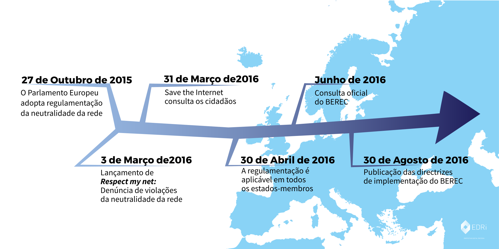

{{ BEGIN MODAL }}
### Internet wins
{{ BEGIN MODAL-SPLIT }}

This summer, hundreds of thousands of Internet users banded together to keep the Internet open and free. Together, we sent a loud, clear message to BEREC, the Body of European Regulators of Electronic Communications: protect net neutrality. 

And it worked! BEREC's final guidelines, which were published on 30 August 2016, offer some of the strongest net neutrality protections we could wish for. So long as these new rules are properly enforced by national telecom regulators, they represent a resounding victory for net neutrality. 

The public has made clear that will not leave the future of its digital public space to big telco lobbyists, but wants to decide for itself. To that end, civil society has to [stay watchful](https://respectmynet.eu/) and observe that telecom operators don't violate the new principles.

The consultation came as the final step of a legislative process that was launched in September 2013. During the ensuing three years, the SaveTheInternet.eu coalition campaigned successfully for the Regulation on which the consultation is based.

**SaveTheInternet.eu wants to thank everyone who participated in this outstanding effort to protect the free, open Internet! Thank you!**

{{ END MODAL }}

{{ BEGIN HOME INTRO }}
{{ BEGIN NAVIGATION }}
{: .navigation__sections}
- [INFORMAÇÃO](#info){: data-scroll="true" }
- [PERGUNTAS FREQUENTES](faq)

{{ END NAVIGATION }}

# Salva a Internet

{: .title-subtext}
Os Reguladores Europeus estão prestes a decidir dar às grandes empresas de telecomunicações o poder de influenciar o que podes (e não podes) fazer online. A Europa precisa urgentemente de directrizes claras de neutralidade da rede para proteger as nossas liberdades e direitos online.

{{ BEGIN COUNTER }}

| X | PESSOAS   ENVIARAM MENSAGENS |

comentários enviados através de savetheinternet.eu, [Avaaz](https://secure.avaaz.org/en/save_the_internet_eu_loc_2016/), [savenetneutrality.eu](https://actionnetwork.org/petitions/save-eu-net-neutrality), [OpenMedia](https://act.openmedia.org/TollBooth/) e [Access Now](https://act.accessnow.org/ea-action/action?ea.client.id=1921&ea.campaign.id=51950)

{{ END COUNTER }}

{{ END HOME INTRO }}

{{ BEGIN HOME FIX-NET-NEUTRALITY }}

## O que é preciso solucionar:

{{ BEGIN HOME SPECIALISED-SERVICES }}

### Serviços Especializados

Os Serviços Especializados ameaçam tornar-se nas vias rápidas pagas para as grandes companhias da Internet, empurrando os outros sites, ideias ou "start-ups" para a via lenta.

[LER MAIS](faq/#o-que-sao-servicos-especializados)

{{ END HOME SPECIALISED-SERVICES }}

{{ BEGIN HOME TRAFFIC-MANAGEMENT }}

### Gestão de Tráfego

Não permitas que o teu fornecedor de Internet decida por ti que tráfego é importante e que serviços desacelera à sua vontade.

[LER MAIS](faq/#o-que-e-gestao-de-trafego)

{{ END HOME TRAFFIC-MANAGEMENT }}

{{ BEGIN HOME ZERO-RATING }}

### "Zero Rating"

Ainda que pareça que te estão a dar algo gratuitamente, o teu operador móvel torna-se guardião da tua conexão e dá-lhe uma razão para reduzir o teu limite mensal de dados.

[LER MAIS](faq/#o-que-e-o-zero-rating)

{{ END HOME ZERO-RATING }}

{{ END HOME FIX-NET-NEUTRALITY }}

{{ BEGIN HOME SPREAD-THE-WORD }}

[Partilha no Facebook](http://www.facebook.com/sharer.php?u=https://savetheinternet.eu/pt/)

[Partilha no Twitter](https://twitter.com/intent/tweet?text=Help%20save%20the%20internet.%20Tell%20your%20regulator%20to%20safeguard%20net%20neutrality.%20http%3A%2F%2Fwww.savetheinternet.eu%2F%20%23SaveTheInternet)

{{ END HOME SPREAD-THE-WORD }}

{{ BEGIN HOME NEWSLETTER }}
{{ END HOME NEWSLETTER }}

{{ BEGIN HOME VIDEO }}
{{ END HOME VIDEO }}

{{ BEGIN HOME INFO }}
{{ ANCHOR INFO }}
## Em 2015, a União Europeia adoptou legislação sobre neutralidade da rede...

[A Regulamentação Europeia](http://eur-lex.europa.eu/legal-content/PT/TXT/?uri=CELEX:32015R2120){: target="_blank" } contém bons princípios para assegurar que possas conectar-te a qualquer ponto da rede sem discriminações. Contudo, existe o risco de que algumas partes da regulamentação sejam usadas abusivamente para subverter a neutralidade da rede. Os legisladores decidiram deixar nas mãos dos reguladores de telecomunicações a responsabilidade de clarificar algumas partes onde o texto é pouco preciso.
{{ END HOME INFO }}

{{ BEGIN HOME BEREC-1 }}
O Organismo de Reguladores Europeus das Comunicações Eletrónicas (BEREC, Body of European Regulators of the Electronic Communications) tem que preparar as directrizes de implementação e interpretar as ambiguidades da lei até finais de Agosto de 2016. Estas directrizes determinarão se a Europa terá uma rede neutra ou não.
{{ END HOME BEREC-1 }}

{{ BEGIN HOME BEREC-2 }}
Em junho de 2016, o BEREC publicará o rascunho das suas directrizes e lançará uma consulta pública. Não obstante, e de acordo com o estabelecido pelos procedimentos do BEREC, o público tem apenas de __6 de Junho a 18 de Julho__ para responder e o BEREC tem de publicar as suas directrizes finais a 30 de Agosto de 2016. Isso significa que os cidadãos têm __poucas semanas__ para responder à consulta e o BEREC tem __pouco mais de um mês__ para processar os (potencialmente) milhares de comentários, actualizar as suas directrizes e depois passar pelo processo administrativo para aceitar formalmente qualquer alteração ao rascunho inicial.
{{ END HOME BEREC-2 }}

{{ BEGIN HOME BEREC-3 }}
## Guia para a Neutralidade da Rede na UE

{{ END HOME BEREC-3 }}

{{ BEGIN HOME BEREC-4 }}
### __Este é um momento crucial: Esta é a fase em que se alcançaram grandes vitórias nos Estados Unidos e na Índia. Portanto, devemos continuar a fazer pressão por uma verdadeira neutralidade da rede, convencendo os reguladores do valor de uma Internet livre e aberta.__

Os reguladores devem prover-se das melhores ferramentas para impor a neutralidade da rede. Na "Save The Internet", pensamos que o BEREC não terá tempo suficiente para processar devidamente e ter em consideração as milhares de respostas (os reguladores de telecomunicações dos Estados Unidos receberam 3,7 milhões de respostas à sua consulta!). Podemos reequilibrar a balança permitindo que todos possam contribuir na elaboração das directrizes de forma mais eficiente.

{{ END HOME BEREC-4 }}

{{ BEGIN HOME COALITION }}
### Juntos defendemos regras firmes de Neutralidade da Rede.

Estes criadores e investidores assinaram a [carta dos empreendedores pela neutralidade da rede](http://www.factory.co/net-neutrality) na Europa, pedindo ao BEREC directrizes firmes, claras e sem lacunas.

{{ END HOME COALITION }}

{{ BEGIN HOME CONTACT-US }}
### Contacta-nos

__Podes contactar-nos através de [info@savetheinternet.eu](mailto:info@savetheinternet.eu)__

Tens uma ideia para melhorar este website? Estupendo, precisamos de ti! O código fonte da página está disponível no [GitHub](https://github.com/Netzfreiheit/STI-UI), podes fazer um "fork", melhorá-lo e fazer "push" de volta.

Algo de que precisamos sempre é de ajuda nas traduções; portanto, se falas algum idioma que não tenhamos ainda coberto, por favor contacta-nos.

### Política de Privacidade

Armazenamos os teus comentários para a consulta do BEREC na caixa de entrada de um endereço de e-mail alojado na Áustria até os encaminhar-mos para a consulta oficial do BEREC. Podes ler a política de privacidade para as consultas do BEREC [aqui](http://berec.europa.eu/eng/document_register/subject_matter/berec_office/download/0/4615-privacy-statement-berec-office-policy-do_0.pdf). A Arbeitskreis Vorratsdaten Österreich e a Bits of Freedom têm acesso aos comentários e endereços de e-mail enviados para o BEREC através deste website, dados que reterão e processarão por razões técnicas. O BEREC publicará todas as respostas que não tenham sido assinaladas como confidenciais. As organizações promotoras desta campanha encontram-se listadas no fundo deste website. Um mês após o encerramento do periodo de consulta oficial eliminaremos todos os comentários e os endereços de e-mail associados a esses comentários.

Recolhemos informação não personalizada neste website através do [Piwik](https://piwik.org/), um software de análise que respeita a privacidade do utilizador.

Se [subscreveres a newsletter](#subscribe-to-newsletter){: data-scroll="true"} o teu endereço de email ficará registado numa mailing list e base de dados que são administradas e alojadas pela European Digital Rights. São a única organização com autorização para te enviar mensagens se subscreveres a newsletter. Podes cancelar a subscrição dessa newsletter a qualquer altura e não receberás mais mensagens.
{{ END HOME CONTACT-US }}

{{ BEGIN HOME SUPPORTED-BY }}
Somos cidadãos preocupados de diferentes organizações de toda a Europa que se importam com as liberdades no espaço digital.
{{ LOGOS SUPPORTED-BY }}
{{ END HOME SUPPORTED-BY }}

{{ BEGIN HOME MADE-BY }}
Com o apoio cordial de
{{ LOGOS MADE-BY }}
{{ END HOME MADE-BY }}
