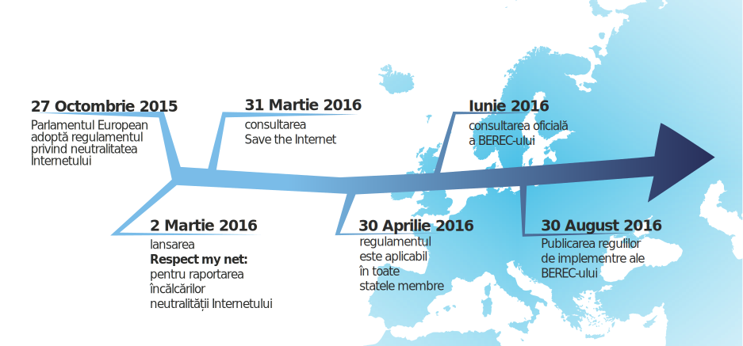

{{ BEGIN MODAL }}
### Internetul câștigă
{{ BEGIN MODAL-SPLIT }}

Vara aceasta, sute de mii de utilizatori de Internet s-au unit pentru a păstra Internetul deschis și liber. Împreună, am trimis un mesaj puternic și clar către BEREC, Organismului Autorităților Europene de Reglementare în Domeniul Comunicațiilor Electronice (Body of European Regulators of Electronic Communications): protejați neutralitatea Internetului.

Iar mesajul a fost ascultat! Forma finală a ghidului BEREC, care a fost publicată pe 30 August 2016, oferă unele dintre cele mai puternice protecții pentru neutralitatea Internetului pe care ni le puteam dori. Cât timp aceste noi reguli sunt aplicate în mod corect de către autoritățile naționale de reglementare în telecomunicații, acestea reprezintă o victorie răsunătoare pentru neutralitatea Internetului.

Publicul și-a făcut foarte clară poziția, și anume ca nu va lăsa viitorul spațiului public digital la voia lobby-ului marilor companii de telecomunicații ci că vrea să decidă el însuși. În acest scop, societatea civilă [trebuie să vegheze](https://respectmynet.eu/) că operatorii de telecomunicații nu încalcă aceste principii.

Consultarea a venit ca un ultim pas al unui proces legislativ care a fost inițiat în septembrie 2013. Pe parcursul următorilor trei ani, coaliția SaveTheInternet.eu a promovat cu succes pentru Regulamentul pe care s-a bazat consultarea.

**SaveTheInternet.eu ține să mulțumească tuturor celor care au participat la această acțiune remarcabilă pentru apărarea Internetului liber și deschis! Vă mulțumim!**

{{ END MODAL }}

{{ BEGIN HOME INTRO }}
{{ BEGIN NAVIGATION }}
{: .navigation__sections}
- [INFORMAȚII](#info){: data-scroll="true" }
- [ÎNTREBĂRI FRECVENTE](faq)
{{ END NAVIGATION }}

# Salvează Internetul

{: .title-subtext}
Autoritățile europene de reglementare în telecomunicații sunt pe cale de a decide dacă vor acorda marilor corporații de telecomunicații puterea de a influența ce putem (și ce nu putem) face online. Europa are nevoie urgentă de un set clar de principii de implementare a neutralității Internetului pentru a proteja libertățile și drepturile noastre digitale.

{{ BEGIN COUNTER }}

| X | MESAJE TRIMISE |

comments sent via savetheinternet.eu, [Avaaz](https://secure.avaaz.org/en/save_the_internet_eu_loc_2016/), [savenetneutrality.eu](https://actionnetwork.org/petitions/save-eu-net-neutrality), [OpenMedia](https://act.openmedia.org/TollBooth/) and [Access Now](https://act.accessnow.org/ea-action/action?ea.client.id=1921&ea.campaign.id=51950)

{{ END COUNTER }}

{{ END HOME INTRO }}

{{ BEGIN HOME FIX-NET-NEUTRALITY }}

## Ce trebuie reparat:

{{ BEGIN HOME SPECIALISED-SERVICES }}

### Servicii Specializate

Serviciile Specializate riscă să devină banda rapidă contra cost pentru marile companii, ceea ce va împinge tot restul site-urilor, ideilor și startup-urilor pe banda lentă.

[CITEȘE MAI MULT](faq/#what-are-specialised-services)

{{ END HOME SPECIALISED-SERVICES }}

{{ BEGIN HOME TRAFFIC-MANAGEMENT }}

### Managementul Traficului

Nu lăsa furnizorul tău de Internet să decidă ce trafic este important și ce servicii online să încetinească, după bunul său plac.

[CITEȘE MAI MULT](faq/#what-is-traffic-management)

{{ END HOME TRAFFIC-MANAGEMENT }}

{{ BEGIN HOME ZERO-RATING }}

### Zero Rating

Pare că primești ceva gratis, dar îți transformă operatorul de telefonie mobilă într-un portar care decide cine intră și cine iese și îi dă un motiv pentru limite de trafic scăzute.

[CITEȘE MAI MULT](faq/#what-is-zero-rating)

{{ END HOME ZERO-RATING }}

{{ END HOME FIX-NET-NEUTRALITY }}

{{ BEGIN HOME SPREAD-THE-WORD }}

[pe Facebook](http://www.facebook.com/sharer.php?u=https://savetheinternet.eu/ro/)

[pe Twitter](https://twitter.com/intent/tweet?text=Help%20save%20the%20internet.%20Tell%20your%20regulator%20to%20safeguard%20net%20neutrality.%20http%3A%2F%2Fwww.savetheinternet.eu%2F%20%23SaveTheInternet)

{{ END HOME SPREAD-THE-WORD }}

{{ BEGIN HOME NEWSLETTER }}
{{ END HOME NEWSLETTER }}

{{ BEGIN HOME VIDEO }}
{{ END HOME VIDEO }}

{{ BEGIN HOME INFO }}
{{ ANCHOR INFO }}
## În 2015, Uniunea Europeană a adoptat o lege privind neutralitatea Internetului ...

[Regulamentul UE](http://eur-lex.europa.eu/legal-content/EN/TXT/?uri=CELEX:32015R2120){: target="_blank" } conține principii bune pentru a asigura că te poți conecta la orice alt punct din Internet fără discriminare. Cu toate acestea, anumite părți ale regulamentului ar putea fi abuzate pentru a submina neutralitatea Internetului. Legiuitorii au decis să lase responsabilitatea clarificării neclarităților din text pe seama autorităților de reglementare în telecomunicații.
{{ END HOME INFO }}

{{ BEGIN HOME BEREC-1 }}
Comitetul autorităților de reglementare a comunicațiilor electronice din Europa (BEREC) trebuie să pregătească ghidul de implementare pentru interpretarea ambiguităților legii până la sfârșitul lui August 2016. Acest ghid va determina dacă Europa se va bucura de neutralitatea Internetului sau nu.
{{ END HOME BEREC-1 }}

{{ BEGIN HOME BEREC-2 }}
În Iunie 2016, BEREC plănuiește să publice o primă versiune a ghidului și să lanseze o consultare publică, Cu toate acestea, regulile de procedură ale BEREC spun că publicul poate răspunde doar în __intervalul 6 Iunie - 18 Iulie__, iar Regulamentul spune că BEREC trebuie să publice forma finală a ghidului pe 30 August 2016. Asta înseamnă că cetățenii vor avea doar __câteva săptămâni__ la dispoziție pentru a răspunde iar BEREC va avea doar __un pic peste o lună__ pentru a procesa comentariile, ajusta ghidul și apoi trece prin procedura administrativă pentru acceptarea formală a oricăror modificări făcute la forma inițială.
{{ END HOME BEREC-2 }}

{{ BEGIN HOME BEREC-3 }}
## Harta Neutralității Internetului în UE

{{ END HOME BEREC-3 }}

{{ BEGIN HOME BEREC-4 }}
### __Acesta este un moment crucial: Acesta este pasul unde au fost obținute succese importante în Statele Unite și în India. De aceea, trebuie să continuăm să luptăm pentru o reală neutralitate a Internetului convingând autoritățile de reglementare de valoarea unui Internet liber și deschis.__

Autoritățile de reglementare trebuie să se înarmeze cu instrumentele necesare pentru aplicarea neutralității Internetului. Considerăm ca BEREC nu va avea suficient timp să proceseze și să ia în considerare în mod atent potențialele zeci de mii de răspunsuri (autoritatea de reglementare din Statele Unite a primit 3.7 milioane de răspunsuri la consultarea lor!). Putem îndrepta balanța facilitând contribuția cât mai eficientă la consultare pentru cât mai multe persoane.

{{ END HOME BEREC-4 }}

{{ BEGIN HOME CONTACT-US }}
### Contactează-ne

__Contactează-ne la [info@savetheinternet.eu](mailto:info@savetheinternet.eu)__

Ai o idee despre cum poate fi îmbunătățit acest site? Excelent, avem nevoie de tine! Codul sursă complet al acestui site este [GitHub](https://github.com/Netzfreiheit/STI-UI) și poate fi forkat, îmbunătățit, remixat și pushat înapoi către noi.

Un lucru de care avem întotdeauna nevoie este ajutor cu traducerile, așa că dacă vorbești o limbă pe care nu o avem încă, te rugăm să ne contactezi.

### Politică de Confidențialitate

Stocăm comentariile tale pentru consultarea BEREC în căsuța de mesaje a unei adrese de e-mail găzduită în Austria până când forwardăm aceste e-mailuri cu comentarii la consultarea oficială BEREC. Poți găsi Politica de Confidențialitate a consultărilor BEREC [aici](http://berec.europa.eu/eng/document_register/subject_matter/berec_office/download/0/4615-privacy-statement-berec-office-policy-do_0.pdf). Arbeitskreis Vorratsdaten Österreich și Bits of Freedom au acces la, prelucrează și vor păstra comentariile și adresele de email trimise BEREC-ului prin intermediul acestui website în scopuri tehnice. BEREC va publica toate răspunsurile care nu sunt marcate ca fiind confidențiale. Organizațiile din spatele acestei campanii sunt listate în josul acestei pagini. La o lună după ce perioada oficială de consultare s-a terminat, vom șterge toate comentariile și adresele de email asociate cu aceste comentarii.

Colectăm informații nepersonalizate pe acest site cu [Piwik](https://piwik.org/), un pachet de web analytics prietenos cu datele tale personale.

Dacă te [abonezi la newsletter](#subscribe-to-newsletter){: data-scroll="true"}, adresa ta de email va fi stocată într-o lista de mailuri și într-o bază de date care este administrată de European Digital Rights. Aceasta este singura organizație care are dreptul de a-ți trimite mesaje dacă te abonezi la newsletter. Te poți dezabona de la newsletter oricând și nu vei mai primi mesaje.
{{ END HOME CONTACT-US }}

{{ BEGIN HOME SUPPORTED-BY }}
Suntem cetățeni din ONG-uri de peste tot din Europa cărora le pasă de libertățile civile în mediul digital.
{{ LOGOS SUPPORTED-BY }}
{{ END HOME SUPPORTED-BY }}

{{ BEGIN HOME MADE-BY }}
Cu ajutor din partea
{{ LOGOS MADE-BY }}
{{ END HOME MADE-BY }}
